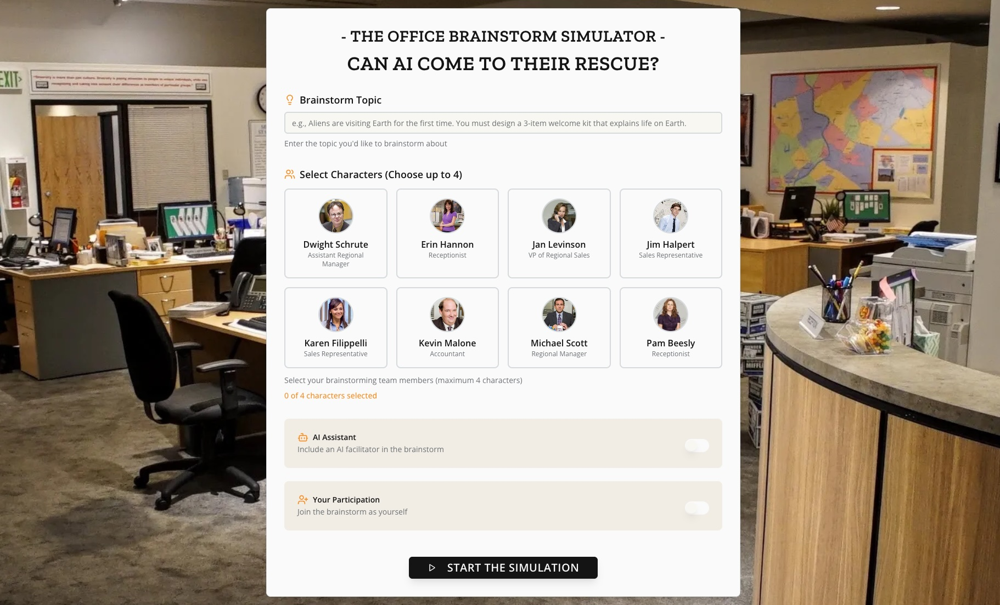
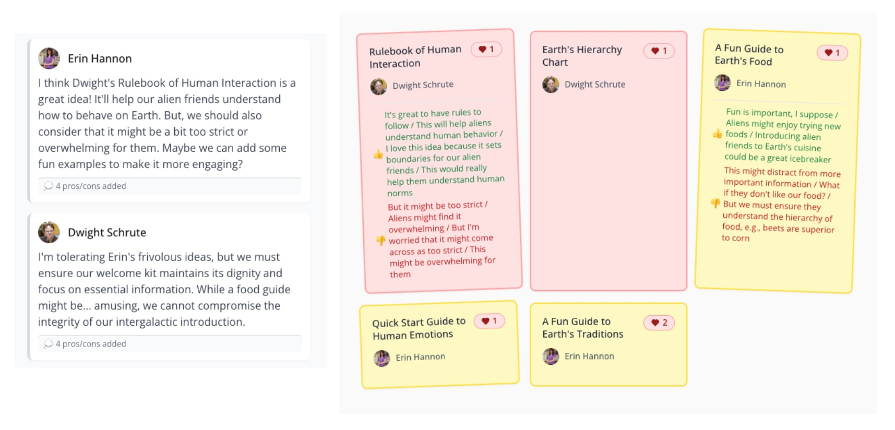
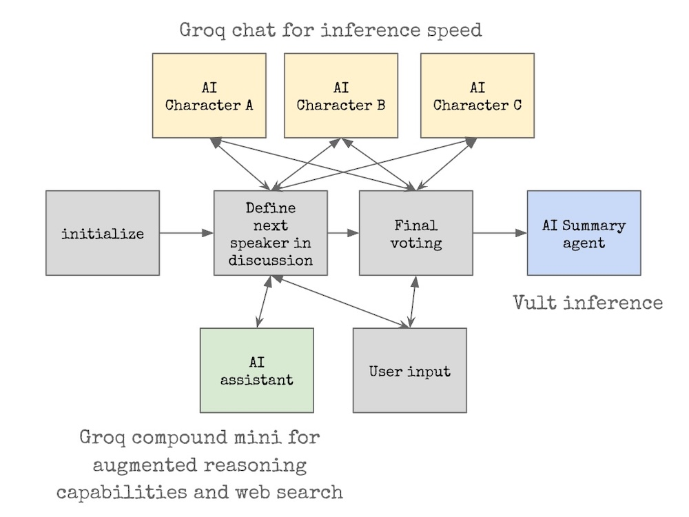

# The Office brainstorm simulator  

Built for the Hack@giki AI Challenge theme: "Build Your Unhinged Dream Project."
Submission: Hack@giki AI Challenge 2026.

AI-driven brainstorming simulator that uses characters from the notoriously dysfunctional team of The Office to explore the future of collaboration.

While most brainstorm tools focus on generating or capturing ideas, this prototype uses AI to address group dynamics — helping teams work better together in the hybrid, human+AI workplace.

## 🚀 Features

- **Character Selection**: Choose from 8 authentic Office characters with distinct personalities
- **AI-Powered Discussions**: Real-time streaming simulation with character-authentic responses
- **Interactive Participation**: Users can contribute messages, sticky notes, and vote alongside AI characters
- **Live Analysis**: Automatic pros/cons analysis of ideas as they're generated
- **AI Assistant**: AI to encourage the group to better work together
- **Voting System**: Democratic selection of top ideas with character-specific reasoning

## 💡 Value Proposition

- Encourages balanced contribution  
- Reduces dominance by loud voices  
- Helps surface overlooked ideas  
- Makes collaboration visible and measurable  

This is about **thinking better together**, not just faster alone.

---

## 🧪 What the Simulator Does


1. Pick a brainstorming topic (e.g., _“3 items to welcome visiting aliens”_)
2. Choose a cast of AI agents — like Michael, Jan, or Dwight from *The Office*
3. Watch the chaos unfold...
4. Option to participate live to the conversation
5. Option to inject an AI assistant and observe if dynamics shift



Participants can:
- Post ideas  
- Add pros & cons  
- Discuss and vote  

A healthy brainstorm is defined by:
- **Participation fairness** (standard deviation of idea shares)  
- **Discussion coverage** (% of ideas with comments)

---

## 🤖 AI Assistant Behaviors

The AI assistant uses LLMs and agent reasoning to:

- Encourage quieter members  
- Nudge discussion of neglected ideas  
- Drop fun facts to lighten the mood (via Groq Compound Mini)  
- De-emphasize repetitive or dominant voices

---

## 📊 Early Results

Simulations were run with and without an AI assistant:

- With AI assistance:
  - Idea coverage slightly improved
  - Participation **fairness didn’t significantly change** (yet)

There’s promising potential — especially with more dynamic group role modeling.

---

## 🛠 Architecture


- **LLMs:**  
  - Groq API (LLaMA 3.3 70B versatile)  
  - Groq Compound Mini (LLaMA 4 + Web search)  
  - Vultr Inference (LLaMA 3.1 70B instruct)

- **Frameworks:**  
  - LangGraph + LangChain  
  - Zod schemas for structured agent protocol (MCP)

- **Frontend:** React + Vite  
- **Backend:** Node.js  
- (deployed om Vultr)
- (developed with Replit)

## 📋 Prerequisites

- Node.js 18+ 
- npm or yarn
- Vultr API key (for AI functionality)

## 🔧 Installation

1. **Clone the repository**:
```bash
git clone https://github.com/bruchansky/officebrainstorm.git
cd officebrainstorm
```

2. **Install dependencies**:
```bash
npm install
```

3. **Set up environment variables**:
```bash
# Required for production
export NODE_ENV=production
export GROQ_API_KEY=your_groq_api_key
export VULTR_API_KEY=your_vultr_api_key
export BASIC_AUTH_USERNAME=your_username
export BASIC_AUTH_PASSWORD=your_password
```

4. **Build the application**:
```bash
npm run build
```

5. **Start the production server**:
```bash
npm start
```

## 📄 License

This project is for educational and entertainment purposes.
